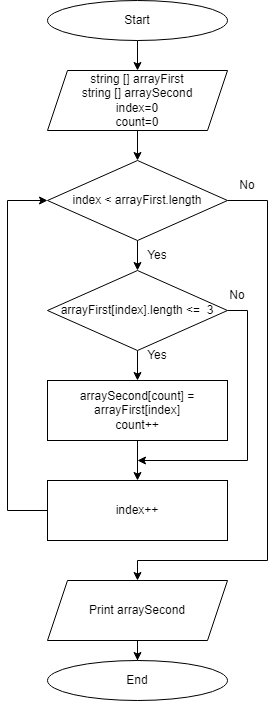

# ***Задача:***

Написать программу, которая из имеющегося массива строк формирует массив из строк, длины которых меньше либо равна 3 символа. Первоначальный массив можно ввести с клавиатуры, либо задать на старте выполнения алгоритма. При решении не рекомендуется пользоваться коллекциями, лучше обойтись исключительно массивами.

# ***Решение:***

Обьявляется заданный массив строк и второй пустой массив, который будет заполняться согласно условию задачи. Index - счетчик по первому массиву, count - по второму массиву.  
В первом условии проверяется index < длины массива, если нет пересчет счетчика index, если Да то проверяется условие задачи: Длина элемента на позиции index в Первом Заданном Массиве меньше либо равна 3. Если условие Да, Второй массив увеличился на одну позицию, элементу Второго Массива с индексом count присваивается значение, что рассматривали в условии, счетчики +1. После выполнения всех условий на выходе выводится результат Print Второй массив.

> Блок-схема  
  

